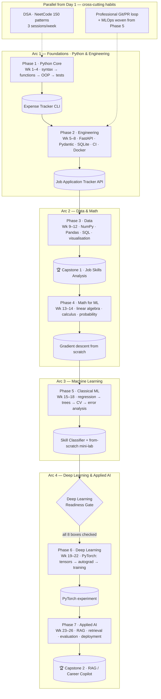

# 🗡️ Ascent of the Shadow Monarch — Road to ML Foundation

<div align="center">


[](https://chingangbamdpakangom.github.io/Road-to-ML-foundation/)


> _"Arise." — The journey begins with a single `git push`._

</div>

A structured, gamified, **project-first** journey from core Python to AI/ML
engineering readiness. You build **6 portfolio projects** — each a prerequisite for
the next — while practising DSA and a professional Git/PR workflow *in parallel from
Day 1*. Every study day ends in a commit; every completed phase evolves the Shadow
Monarch — from a dormant silhouette to the **Ascended Monarch**.

---

## 🚀 Start Here

| File | What it is |
|------|------------|
| **[ROADMAP.md](ROADMAP.md)** | The plan — **26 weeks, 7 phases, 6 projects**, and the **Deep Learning Readiness Gate** that must pass before PyTorch |
| **[PROGRESS.md](PROGRESS.md)** | The tracker — tick a box every study day, current week marked 👉 |
| **[guides/](guides/)** | Weekly study guides — the document to follow each day (currently: [Week 1 · Python Core](guides/week01_python_core.md)) |
| **[01_python_foundations/week01_theory.ipynb](01_python_foundations/week01_theory.ipynb)** | 📖 Week 1 theory & reading — topics + the "why"; you do the hands-on |
| **[00_workspace_git/](00_workspace_git/README.md)** | 🧰 Module 0 — workspace & git/GitHub, practiced daily by shipping |
| **[docs/evolution_stages.md](docs/evolution_stages.md)** | 🗡️ The character — full pixel-art evolution gallery |
| **[🌌 Live Quest Graph](https://chingangbamdpakangom.github.io/Road-to-ML-foundation/)** | Interactive node map of every task — colored live from PROGRESS.md ([source](docs/quest_graph.html)) |

**Daily rhythm:** study the day's topic → code every exercise yourself → one DSA
pattern problem → answer the interview questions out loud → commit & push. The GitHub
contribution graph is the heatmap.

---

## 🗺️ The 26-Week Plan



| Phase | Weeks | Focus | Ships |
|:-----:|:-----:|-------|-------|
| 1 | 1–4 | 🐍 Python Core — syntax → functions → OOP → tests → CLI | Expense Tracker CLI |
| 2 | 5–8 | ⚙️ Engineering — FastAPI, Pydantic, SQLite, CI, Docker | Job Application Tracker API |
| 3 | 9–12 | 📊 Data — NumPy, Pandas, SQL, Matplotlib/Seaborn | 🏆 Capstone 1: Job Skills Analysis |
| 4 | 13–14 | 📐 Math for ML — linear algebra, calculus, probability | Gradient descent from scratch |
| 5 | 15–18 | 🤖 Classical ML — regression → trees → CV → error analysis | Skill Classifier (+ from-scratch mini-lab) |
| 6 | 19–22 | 🧠 Deep Learning — PyTorch: tensors → autograd → training | Reproducible PyTorch experiment |
| 7 | 23–26 | 🚀 Applied AI — RAG, retrieval, evaluation, **deployment** | 🏆 Capstone 2: RAG / Career Copilot |

**Parallel tracks (from Day 1):** 🧩 DSA (NeetCode 150 patterns, 3×/week) ·
⚙️ Professional Git/PR loop (from Phase 2) · 🔧 MLOps — Docker, CI/CD, model cards,
cost/latency (woven from Phase 5). Full week-by-week detail and the readiness
checklist live in **[ROADMAP.md](ROADMAP.md)**.

---

## 🎮 Evolution System

Each completed phase transforms the character — see the
[full pixel-art gallery](docs/evolution_stages.md).

| Stage | Name | Unlocks when | Current |
|:-----:|------|--------------|:-------:|
| 0 | 🔒 Dormant | Starting point | 👉 |
| 1 | 🟦 Awakened | Phase 1 — Python Core complete (Expense Tracker CLI) | |
| 2 | 🟣 Shadow Initiate | Phase 2 — Engineering complete (Job Tracker API) | |
| 3 | 🟡 Shadow Knight | Phase 3 — Data complete (🏆 Capstone 1) | |
| 4 | 🔴 Shadow Lord | Phases 4–5 — Math + Classical ML complete (Skill Classifier) | |
| 5 | 👑 Shadow Monarch | Phase 6 — Deep Learning complete (**passed the DL Readiness Gate**) | |
| 6 | 🟠 Ascended Monarch | Phase 7 — Applied AI capstone shipped → **job-ready** | |

---

## 🗂️ Repository Structure

```
Road-to-ML-foundation/
├── ROADMAP.md                     ← the plan (26 weeks, 7 phases)
├── PROGRESS.md                    ← the tracker
├── guides/                        ← weekly study guides (one added per week)
│   └── week01_python_core.md
├── 00_workspace_git/              ← Module 0: git/GitHub by daily use
├── 01_python_foundations/
│   ├── week01_theory.ipynb        ← 📖 Week 1 theory & reading (topics + the "why")
│   ├── scratchpad.ipynb           ← free-experiment lab bench
│   ├── 01_basics/                 ← your hands-on notebooks
│   ├── 02_data_structures/  …     ← (map to Weeks 2–3 under v3)
│   └── expense_tracker/           ← Phase 1 project — the Expense Tracker CLI
├── 04_interview_prep/
│   └── python_qa.md               ← interview answers, written daily
└── docs/
    └── evolution_stages.md        ← pixel-art gallery
```

Later phase folders (engineering API, data, ML, deep learning, applied AI) are
created when their phases begin.

---

## ⚡ Setup

```bash
git clone https://github.com/ChingangbamDpakAngom/Road-to-ML-foundation.git
cd "Road-to-ML-foundation/01_python_foundations"
python -m venv .venv
source .venv/Scripts/activate          # Windows Git Bash · (macOS/Linux: source .venv/bin/activate)
python -m pip install --upgrade pip pytest ruff
```

Phase-specific libraries (NumPy, Pandas, FastAPI, scikit-learn, PyTorch, …) are
installed at the start of each phase — one toolchain at a time, not all at once.

---

## 📚 Core Resources (one per phase, finished — not five, sampled)

| Phase | Resource |
|-------|----------|
| Python Core | [Official tutorial](https://docs.python.org/3/tutorial/) + [Real Python](https://realpython.com/) |
| Engineering | [FastAPI docs](https://fastapi.tiangolo.com/) · [pytest](https://docs.pytest.org/) · [GitHub Actions](https://docs.github.com/actions) |
| Data | [Python Data Science Handbook](https://jakevdp.github.io/PythonDataScienceHandbook/) (free) · [SQLBolt](https://sqlbolt.com/) |
| Math | [3Blue1Brown](https://www.youtube.com/@3blue1brown) (LinAlg + Calculus) · [StatQuest](https://www.youtube.com/@statquest) |
| Classical ML | Hands-On ML (Géron) ch. 1–9 + [scikit-learn user guide](https://scikit-learn.org/stable/user_guide.html) |
| Deep Learning | [PyTorch tutorials](https://docs.pytorch.org/tutorials/) → Karpathy's *Zero to Hero* |
| Applied AI / MLOps | [Docker Get Started](https://docs.docker.com/get-started/) · [Google Model Cards](https://modelcards.withgoogle.com/about) |
| DSA (all) | [NeetCode 150](https://neetcode.io/practice/practice/neetcode150) |

---

## 💼 Where This Leads

This is a **project-first** track: you finish with 6 portfolio pieces, a deployed
applied-AI capstone, a DSA habit, and a professional workflow — the profile junior
UK/global AI/ML job ads actually screen for.

| After completing this repo, apply for | Honest scope |
|----------------------------------------|--------------|
| Junior ML/AI Engineer · Python Developer · Data Scientist/Analyst · MLOps-adjacent | Foundational depth across the full stack — **not** research-level DL, large-scale distributed training, or specialised CV/NLP. Those are the next mountain. |

---

## 📜 License

MIT — see [LICENSE](LICENSE).

<div align="center">
<sub>🗡️ Ascent of the Shadow Monarch · one commit at a time · 2026</sub>
</div>
