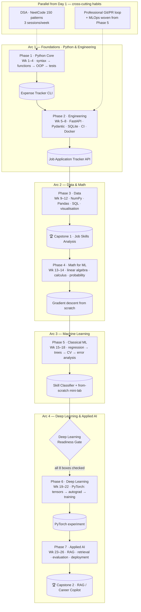

# 🗺️ Refined Roadmap — Road to ML Foundation

> Single source of truth for the learning schedule. The gamified README
> (README_igris_upgrade.md) is the fun layer; **this file is the plan**.
> Repo: https://github.com/ChingangbamDpakAngom/Road-to-ML-foundation
>
> Pace assumption: **1.5–3 hours/day, 6–7 days/week.** If a week isn't done,
> the week rolls over — never skip ahead with gaps.

---

## Why this revision (v3 — project-first merge)

v2 was a solid **topic-first** track (learn NumPy → Pandas → ML → a bridge to DL),
and it correctly added a **math phase** and a **from-scratch neural network** that
most self-taught plans skip. We keep both of those — they are the reason this repo
doesn't stall where self-taught journeys usually do.

What v2 was thin on, and what real junior Python/MLOps/ML job ads actually test:

1. **Software engineering** — turning scripts into a *tested service* (FastAPI,
   SQLite, validation, CI, packaging). Employers hire engineers who ship, not
   people who ran a notebook once.
2. **MLOps & deployment** — Docker, CI/CD, model cards, cost/latency awareness.
   A 2026 UK junior ML posting listing "productionising ML models" is now normal.
3. **DSA as a habit, from Day 1** — not a Week-14 cram. There is a real coding bar
   even for "junior" ML roles.
4. **A project-first spine** — 6 portfolio assets, each a prerequisite for the next,
   instead of disconnected topic weeks. Recruiters open *projects*, not topic lists.
5. **Deep learning as a real phase** — 4 weeks of PyTorch + an applied AI capstone,
   not a 2-week bridge.

So v3 adopts a **6-project engineering spine** and **weaves MLOps, DSA, and the
professional Git/PR workflow through all of it** — while transplanting v2's
**Math phase (Phase 4)** and **Deep Learning Readiness Gate** intact, right before
the PyTorch phase. This is longer (~26 weeks vs 14), and that length is the honest
price of "job-ready," not "finished a tutorial."

**Source:** merges the topic plan with *The Practical Python-to-AI/ML Engineer
Playbook* (`The_Practical_Python_to_AI_ML_Engineer_Playbook_MASTER.pdf`).

---

## 🧱 The portfolio spine (what you'll have built)

Each project proves a hire-able capability and is a prerequisite for the next.

| # | Project | What it proves |
|:-:|---------|----------------|
| 1 | **Expense Tracker CLI** | Core Python, files, errors, tests, project completion |
| 2 | **Job Application Tracker API** | Engineering: HTTP, DB design, validation, testing, CI |
| 3 | **Job Skills Analysis** (Capstone-grade EDA) | Data cleaning, SQL/Pandas, visualisation, written insight |
| 4 | **Skill Classifier** | ML workflow, metrics, model comparison, error analysis |
| 5 | **PyTorch experiment** | Deep-learning fundamentals, reproducible experimentation |
| 6 | **RAG Research Assistant / Career Copilot** | Applied AI: grounding, evaluation, safety, deployment |

### 🗺️ At a glance

---

## 📅 The 26-Week Plan

### Phase 1 — Python Core (Weeks 1–4) → *Expense Tracker CLI*

| Week | Focus | Ship |
|:---:|-------|------|
| 1 | Setup, venv, variables, conditions, loops, functions, args/kwargs, scope | Repo + `add-expense` command; 5+ commits |
| 2 | Lists/tuples/sets/dicts, comprehensions, JSON, exceptions | Persistence + categories; bad input handled |
| 3 | Modules, paths, OOP (classes, inheritance, dunders), generators, type hints, **pytest** | Filters + monthly totals; 10+ tests, modular code |
| 4 | Refactor, decorators, CLI UX (`argparse`/`Typer`), README, `v1.0` release | v1.0 release + demo; 15+ tests; runs from README |

> **Expense Tracker CLI spec:** commands `add / list / filter / summary / delete / edit`;
> data = date, amount, category, description; JSON storage (CSV export optional);
> invalid amount/date/category returns a *helpful* error.

### Phase 2 — Python Engineering (Weeks 5–8) → *Job Application Tracker API*

| Week | Focus | Ship |
|:---:|-------|------|
| 5 | HTTP, REST, **FastAPI**, **Pydantic** + type hints, SQLite schema | Create/list companies & applications |
| 6 | CRUD endpoints, validation, filters | Working endpoints + interactive docs + API tests |
| 7 | SQL, logging, error handling, env variables | Status updates & deadline queries; DB tests, useful logs |
| 8 | **CI (GitHub Actions), packaging, README, Docker (first pass)** | Passing CI; clean install; container runs |

> Start applying the **Professional Workflow** (below) from this phase: the Git/PR
> loop and experiment-tracking habits, on *every* feature from here on.

### Phase 3 — Data Foundations (Weeks 9–12) → *Job Skills Analysis*

| Week | Focus | Ship |
|:---:|-------|------|
| 9 | NumPy arrays (indexing, reshape, **broadcasting**, masking, `np.random`, intro `linalg`); Pandas import/inspect | Data dictionary + raw import; source & limits recorded |
| 10 | Cleaning, missing values, merges, groupby/agg, pivot, time-series basics | Reproducible cleaning pipeline |
| 11 | SQL (SELECT/WHERE/JOINs/GROUP BY/subqueries/window fns), descriptive stats, Matplotlib + Seaborn | Skill/role analysis where each chart answers one question |
| 12 | Narrative report, reproducibility | 🏆 **CAPSTONE 1: full EDA notebook** — question → cleaning → 6+ visuals → written conclusions a reader can reproduce |

> **Notebook rule:** this is the one phase where a notebook *is* the natural home
> for exploration + final charts. But any reusable cleaning logic still moves into a
> `.py` module (see Professional Workflow).

### Phase 4 — Math for ML (Weeks 13–14) 🧮 *kept from v2 — do not skip*

| Week | Focus | Ship |
|:---:|-------|------|
| 13 | **Linear algebra**: vectors, matrix multiplication (by hand *and* `np.dot`), norms, linear transformations, eigen-decomposition, SVD intuition. *3Blue1Brown "Essence of Linear Algebra" + NumPy exercises* | Notebook: matrix ops from scratch, verified against NumPy |
| 14 | **Calculus + probability**: derivatives, chain rule, partial derivatives, gradients; distributions, Bayes, expectation/variance, MLE, CLT. *3Blue1Brown "Essence of Calculus", StatQuest* | **Gradient descent from scratch** minimising a function, with a loss-curve plot |

> Every math topic ends as a NumPy notebook, not just watched videos.
> Watching ≠ learning; implementing = learning.

### Phase 5 — Classical ML (Weeks 15–18) → *Skill Classifier*

| Week | Focus | Ship |
|:---:|-------|------|
| 15 | Framing, train/test split, **leakage**, baselines, preprocessing (scaling/encoding/imputation), TF-IDF, **Linear & Logistic Regression** — connect directly to Week 14's gradient descent | Baseline classifier + linear regression two ways (sklearn *and* your own GD) |
| 16 | Trees (Gini/entropy), Random Forest, Gradient Boosting, SVM, KNN, Naive Bayes; **Pipelines, cross-validation, model comparison** | Compare 3+ models honestly; metrics reported consistently |
| 17 | Precision/recall/F1, ROC-AUC, imbalance, GridSearchCV, `ColumnTransformer`, **error analysis** | End-to-end tuned pipeline; misclassified examples explained |
| 18 | Model saving, inference API/UI, **model card** + **from-scratch mini-lab** | Reproducible inference + limits; linreg/logreg/K-Means/PCA in NumPy vs sklearn |

### 🚪 Deep Learning Readiness Gate — *kept from v2*

Do **not** start Phase 6 until every box is checked:

- [ ] I can explain and hand-compute a matrix multiplication and why shapes must align
- [ ] I can derive the gradient of MSE loss for linear regression and explain the chain rule
- [ ] I implemented gradient descent from scratch and watched the loss decrease
- [ ] I implemented logistic regression from scratch (sigmoid + cross-entropy + gradients)
- [ ] I built the from-scratch mini-lab (linreg, logreg, K-Means, PCA) in NumPy
- [ ] I can explain bias-variance, overfitting, regularization (L1/L2), CV without notes
- [ ] I have a data capstone + a Skill Classifier with proper READMEs pushed to GitHub
- [ ] I can write a JOIN and a GROUP BY in SQL without looking it up

### Phase 6 — Deep Learning (Weeks 19–22) → *PyTorch experiment*

| Week | Focus | Ship |
|:---:|-------|------|
| 19 | Tensors, shapes, devices, `Dataset`/`DataLoader` | Data pipeline; shapes documented correctly |
| 20 | `nn.Module`, loss, optimiser, **autograd**, training loop | Baseline training loop; losses saved + plotted |
| 21 | Regularisation/augmentation, one controlled-change experiment | Change and its effect stated |
| 22 | Evaluation, saving/loading, experiment report | Complete experiment: failure cases + model artefact |

> Also worth building here (from v2's spirit): a **2-layer neural network in pure
> NumPy** (forward pass + backprop via chain rule) so you *understand* what PyTorch
> automates. Do it as a Week-19 warm-up if the gate above felt shaky.
>
> **Notebook rule:** notebook only for the first tensor/shape exploration (Week 19).
> From Week 20 the training loop lives in a `.py` script you can rerun identically.

### Phase 7 — Applied AI Capstone (Weeks 23–26) → *RAG / Career Copilot*

| Week | Focus | Ship |
|:---:|-------|------|
| 23 | Problem scope, architecture, ingestion | Retrieval/workflow running; architecture diagram + samples |
| 24 | Embeddings, chunking, retrieval, citations | Grounded answer pipeline; sources exposed to the user |
| 25 | Evaluation set, failure cases, guardrails | Evaluate 20–30 examples; results & failures documented |
| 26 | Polish, **deployment (Docker + cloud)**, demo, README | 🏆 **CAPSTONE 2**: 2–3 min demo; reproducible setup; model card |

> **Choose one:** *Research Paper Assistant* (small permitted corpus, cited answers)
> or *AI Career Copilot* (CV/JD input, skill-gap plan, ties into your Phase-2 API).

---

## 🧵 Cross-cutting tracks (run these in parallel, not after)

### DSA — from Day 1 (3 sessions/week, ~20% of time)
Practise **patterns, not random questions.** One session = review an old problem
(10m) → learn one pattern (10m) → attempt one unaided (25m) → if blocked 25–30m,
read a hint then re-code independently → record signal, complexity, mistake (5m).

| Weeks | Patterns | Target |
|:---:|---------|:---:|
| 1–2 | Big-O, arrays, strings, hash maps, sets | 12 easy |
| 3–4 | Two pointers, sliding window, prefix sums, sorting | 12 |
| 5–6 | Stacks, queues, binary search, linked lists | 14 |
| 7–8 | Recursion, trees, BST traversal | 10 |
| 9–10 | Heaps, graphs, BFS/DFS | 10 |
| 11–12 | Backtracking, intervals, review/mock | re-solve 10 |
| after | DP basics + timed interview practice | 2–3/wk |

Set: **NeetCode 150** (pattern-grouped) — https://neetcode.io/practice/practice/neetcode150

### MLOps & evaluation — woven from Phase 5 onward
For every model from the Skill Classifier on, the README gets a written evaluation
section, not just an accuracy number:
- State the metric and *why* it fits (F1 for imbalance, not accuracy).
- Baseline vs improved **comparison table** (numbers, not prose).
- 3–5 concrete **failure examples** + one-line cause each.
- A short **"known limitations"** paragraph.
- For the capstone: **cost/latency** (p50/p95, cost per query, token usage) + a **model card**.

**Deployment mini-module** (practise once in Weeks 7–8, fully in Weeks 23–26):
containerise (Dockerfile) → local run check → cloud deploy (Render/Fly.io free tier)
→ CI/CD (Actions: test then build/push on merge) → document (architecture diagram + steps).

### Professional workflow — from Phase 2 onward
- **Notebook = disposable scratchpad. Script/module = the deliverable.** (Matches `CLAUDE.md`.)
- **Git/PR loop per Issue:** `git switch -c feature/x` → failing test first if practical
  → small commits (`feat:`/`test:`/`fix:`) → `pytest -q && ruff check .` → push, open a PR
  to yourself, re-read your own diff top-to-bottom (that *is* code review) → merge, close Issue.
- **Experiment log** every run: `run_id`, model/config, metrics, baseline comparison,
  dataset version, notes (a simple CSV/markdown table; MLflow/W&B only once comfortable).

### Interview loop — prepared throughout, sprinted at the end
Recruiter screen → DSA/coding screen → ML coding (implement an algo by hand) → ML
breadth (explain *why*) → ML/LLM system design → project deep-dive → behavioral.
Build a **STAR story bank** from real project moments as you go (a specific bug, a
trade-off like TF-IDF vs embeddings, learning FastAPI mid-sprint, a misleading metric
you corrected). Run the **8-week interview sprint** near the end of Phase 7.

**Final readiness check:** you can (1) solve a medium LeetCode cleanly, (2) implement
logistic regression from memory, (3) explain your capstone's architecture + failure
modes in <10 min, (4) tell 3 STAR stories without notes.

---

## 📏 Daily Rhythm

- **Study block** — learn the day's topic (video/docs/book).
- **Code block** — implement it yourself in a `.py` module or notebook — no copy-paste.
- **DSA block** — one pattern session (3×/week).
- **Push** — ≥1 commit/day with a meaningful message (GitHub's contribution graph is the real heatmap).
- **Fri/Sun** — 20-min weekly review: redo one thing from memory.

## 📚 Core resources (don't collect more — finish one per phase)

| Phase | Resource |
|-------|----------|
| Python Core | Official Python Tutorial + Real Python; pytest getting-started |
| Engineering | FastAPI docs, pytest full docs, GitHub Actions, Git docs |
| Data | Python Data Science Handbook (VanderPlas, free); "10 minutes to pandas" |
| Math | 3Blue1Brown (LinAlg + Calculus), StatQuest |
| Classical ML | Hands-On ML (Géron) ch. 1–9 + scikit-learn User Guide |
| SQL | sqlbolt.com, LeetCode SQL |
| Deep Learning | PyTorch "Learn the Basics" → Karpathy "Neural Networks: Zero to Hero" |
| Applied AI / MLOps | Docker Get Started, Render deploy docs, Google Model Cards |
| DSA (all) | NeetCode 150 |

One resource per phase, finished, beats five resources sampled.
