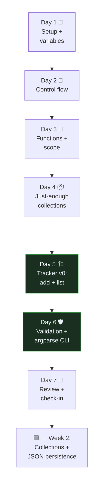

# ⚔️ Week 1 Guide — Python Core (Phase 1 of 7)

> **Read this first.** This is **Week 1 of a 4-week Python Core phase** (v3 plan).
> It is *not* a sprint — the old "cram 2 weeks into 7 days" guide is retired.
> The heavy topics (OOP, decorators, generators, files) now live in Weeks 2–3,
> where they get room to breathe. This week you build the *foundation* and ship
> the first working slice of your **Expense Tracker CLI**.
>
> - **Time**: 1.5–3 focused hours/day, 6–7 days/week. No compression.
> - **Rule of hands**: every concept gets typed by *you*. Reading without coding = zero.
> - **Ship target (exit evidence)**: `venv` works · **5+ commits** · a working
>   `add` and `list` for expenses you can run from the terminal.
>
> **Daily structure:**
> 1. 📖 Study (45–60 min) — the day's material
> 2. ⌨️ Code (45–90 min) — every exercise, no copy-paste
> 3. 🧩 DSA (20–30 min, 3 days this week) — one NeetCode pattern problem
> 4. 🎤 Interview reps (15 min) — answer the day's Qs **out loud**, then write them in `04_interview_prep/python_qa.md`
> 5. ✅ Commit & push — update `PROGRESS.md`, meaningful message
>
> Work in `01_python_foundations/`. The Expense Tracker lives in a new folder:
> `01_python_foundations/expense_tracker/`.

## 🗺️ The week at a glance



> **Scope honesty:** this week's tracker keeps expenses **in memory only** — it
> forgets everything when you close it. That's on purpose. **JSON persistence is
> Week 2.** Don't jump ahead; a clean in-memory version first makes persistence easy.

---

## 📅 Day 1 — Setup, venv, First Commit + Variables & Strings

**Study:** [Python tutorial ch. 3](https://docs.python.org/3/tutorial/introduction.html) · variables, `int/float/str/bool`, f-strings, core string methods (`.strip`, `.lower`, `.split`, `.join`) · [venv docs](https://docs.python.org/3/library/venv.html)

**Set up (do this once, properly):**
```bash
cd "01_python_foundations"
python -m venv .venv
source .venv/Scripts/activate   # Windows Git Bash
python -m pip install --upgrade pip pytest ruff
mkdir -p expense_tracker
```
Add a `.gitignore` line for `.venv/` if it isn't ignored already, then commit:
`Day 1: set up venv + tooling for Python Core phase`.

**Code — exercises (in `01_basics/day1_basics.ipynb`, which you've started):**
1. FizzBuzz (1–50).
2. Given a string, print it reversed, uppercased, and report vowel count — f-strings only.
3. Format one expense as a line: given `amount=12.5, category="food"`, print `"£12.50  food"` — practise f-string number formatting (`:.2f`) and alignment.
4. Parse `"2026-07-22"` into year/month/day with `.split("-")` and int conversion.

**🧩 DSA session 1:** [Two Sum](https://neetcode.io/problems/two-integer-sum) — hash-map pattern. Log it (problem, approach, time complexity, one mistake).

**🎤 Interview Qs:**
- Q1: What's the difference between `is` and `==` in Python? *(you've answered this)*
- Q2: Is Python pass-by-value or pass-by-reference? What happens when you pass a list to a function? *(you've answered this)*

**Commit:** `Day 1: variables, strings, f-string formatting + Two Sum`

---

## 📅 Day 2 — Control Flow

**Study:** [Python tutorial ch. 4](https://docs.python.org/3/tutorial/controlflow.html) · `if/elif/else`, truthiness (what's falsy), `for`, `while`, `range`, `break`/`continue`, `enumerate`

**Code — exercises:**
1. Guess-the-number game: random target, loop until guessed, count attempts, give "higher/lower" hints.
2. Right triangle of `*` of height `n` (nested loops).
3. Sum all numbers 1–1000 divisible by 3 or 5 — once with a `for` loop, once with `sum()` + `range` + a comprehension. Note which reads better.
4. Given a list of amounts `[12.5, -3, 0, 40]`, loop with `enumerate` and print only the positive ones with their index.

**🧩 DSA session 2:** [Contains Duplicate](https://neetcode.io/problems/duplicate-integer) — set pattern.

**🎤 Interview Qs:**
- Q3: What values are "falsy" in Python? How does `if my_list:` behave for an empty list?
- Q4: Difference between `range(n)` and `list(range(n))` — why does `range` not build the whole list? (first taste of lazy evaluation)

**Commit:** `Day 2: control flow — guessing game, patterns, filtering + Contains Duplicate`

---

## 📅 Day 3 — Functions & Scope

**Study:** functions, parameters, default args (⚠️ the **mutable-default-argument trap**), returning tuples, `*args`/`**kwargs`, scope/**LEGB**, `global`/`nonlocal`

**Code — exercises:**
1. `stats(*numbers)` → returns `(mean, min, max)` as a tuple; call it with a list using `*` unpacking.
2. Demonstrate the mutable-default bug (`def add(item, acc=[])`), then fix it with `None`. Write the *why* as a comment.
3. `make_expense(amount, category, description="")` → returns a dict `{"amount":…, "category":…, "description":…, "date":…}`. This becomes the heart of your tracker.
4. `summarise(**totals)` — accepts `food=40, travel=15` etc. and prints each category's share of the total.

**🧩 DSA session 3:** [Valid Anagram](https://neetcode.io/problems/is-anagram) — dict/counter pattern.

**🎤 Interview Qs:**
- Q5: What is the LEGB rule? What do `global` and `nonlocal` do?
- Q6: What are `*args` and `**kwargs`? Show one real use case.

**Commit:** `Day 3: functions, args/kwargs, scope + make_expense record + Valid Anagram`

---

## 📅 Day 4 — Just-Enough Collections (Lists & Dicts as Records)

> Full data-structures deep dive is **Week 2**. Today you learn only what the
> tracker needs: a **list of expense dicts**.

**Study:** list basics (`append`, indexing, slicing, `len`, iteration); dict basics (`[]` vs `.get`, `.keys`, `.items`, updating); a "record" = one dict, a "table" = a list of those dicts

**Code — exercises:**
1. Build `expenses = []`, append three `make_expense(...)` dicts, then loop and print each as a formatted line.
2. `total(expenses)` → sum of all amounts. `total_for(expenses, category)` → sum for one category (loop + `if`).
3. `categories(expenses)` → the set of distinct categories present.
4. Find the single most expensive expense (loop, track the max) — no `max(key=...)` yet, do it by hand to feel the pattern.

**🎤 Interview Qs:**
- Q7: When would you use a list vs a dict to model data? Why is a dict the right shape for one expense?
- Q8: What does `dict.get("x")` return if the key is missing, and why is that safer than `dict["x"]`?

**Commit:** `Day 4: model expenses as a list of dicts — total, filter, distinct categories`

---

## 📅 Day 5 — 🏗️ Expense Tracker v0: `add` + `list`

**Build — `01_python_foundations/expense_tracker/expenses.py`:**

An in-memory tracker proving Days 1–4. **No files yet** — persistence is Week 2.

- `make_expense(amount, category, description="")` → validated dict (reuse Day 3)
- `add_expense(expenses, amount, category, description="")` → appends, returns the new record
- `list_expenses(expenses)` → prints a neat table (aligned columns via f-strings)
- `summary(expenses)` → total + per-category totals
- A `main()` menu loop: `while True` + `input()` offering `add / list / summary / quit`

Keep every piece a small function. `main()` just wires them together.

**🎤 Interview Qs:**
- Q9: Why break a script into small functions instead of one long block? (testability, reuse, readability)
- Q10: Your tracker forgets everything on exit. What's the *one* change that would fix that, and why isn't it in this week? (names the Week-2 bridge: file/JSON persistence)

**Commit:** `Day 5: expense tracker v0 — add/list/summary menu loop (in-memory)`

---

## 📅 Day 6 — Validation + `argparse` CLI

> ROADMAP exit evidence for Week 1 is *"repo + `add-expense` command."* Today you
> make it runnable straight from the terminal, not just an interactive menu.

**Study:** basic `try/except` around `float(...)` (light — full exception handling is Week 2); [`argparse` tutorial](https://docs.python.org/3/howto/argparse.html) — subcommands, positional args, `--help`

**Code:**
1. In `make_expense`, reject a non-numeric amount and a negative amount with a *helpful* message (not a raw traceback). A basic `try/except ValueError` is enough for now.
2. Add an `argparse` interface so these work from the shell:
   ```bash
   python expenses.py add 12.50 food --desc "lunch"
   python expenses.py list
   ```
   *(In-memory means each run starts empty — that's expected this week. The point is a real CLI surface with `--help` and argument parsing, not hardcoded variables.)*
3. Run `ruff check .` and fix what it flags.

**🎤 Interview Qs:**
- Q11: Why validate user input at the boundary instead of trusting it? Give a concrete bad-input example for the tracker.
- Q12: Why use `argparse` over hardcoded variables or `input()` for a real tool? (scriptability, `--help`, testability)

**Commit:** `Day 6: input validation + argparse CLI (add/list subcommands), ruff-clean`

---

## 📅 Day 7 — Review + Weekly Check-in

**Review (60–90 min):**
1. Re-answer all 12 interview questions out loud, no notes. Any you fumble → reread that day's topic and tighten your `python_qa.md` answer.
2. From memory, write: one function with `*args`, one `for` loop that filters a list of dicts, and the `make_expense` record. Compare with your Day 3–5 code.
3. **DSA review:** re-solve [Group Anagrams](https://neetcode.io/problems/anagram-groups) building on Valid Anagram.
4. Update `PROGRESS.md`: tick the Week 1 boxes honestly and add a push-log line.

**Week 1 exit test (all must be true):**
- [ ] `venv` activates and `pytest`/`ruff` are installed
- [ ] `python expenses.py add …` and `python expenses.py list` run without crashing
- [ ] I can write a function with `*args`/`**kwargs` and explain LEGB without notes
- [ ] I modelled expenses as a list of dicts and can total/filter them
- [ ] 5+ meaningful commits this week; 4 DSA problems logged
- [ ] I answered all 12 interview questions out loud

**Commit:** `Week 1 COMPLETE: Python Core foundations + expense tracker v0 🟦`

> 🟦 **Week 1 done.** Next: ask Claude to *"create the week 2 guide"* — collections
> deep dive + **JSON persistence** (the tracker finally remembers your expenses).

---

## 🧭 About your existing folders

You scaffolded `02_data_structures … 07_project_task_manager` under the old sprint.
Nothing is wasted — under v3 they just map to later weeks (data structures → Week 2,
OOP → Week 3, decorators/generators → Week 3, files/exceptions → Week 2). The one
change: **the Phase-1 project is the Expense Tracker, not the Task Manager.** Keep
`07_project_task_manager/task_manager.py` as a personal warm-up if you like, or
rename it later — but this week's deliverable lives in `expense_tracker/`.

## 📚 If you get stuck

- One concept, ≤ 20 min stuck → reread + try a smaller example.
- Still stuck → ask Claude to *explain* (not solve) — you still type the solution.
- Falling behind → it's a 4-week phase now; a slow week rolls into the next. Keep the commits honest.
